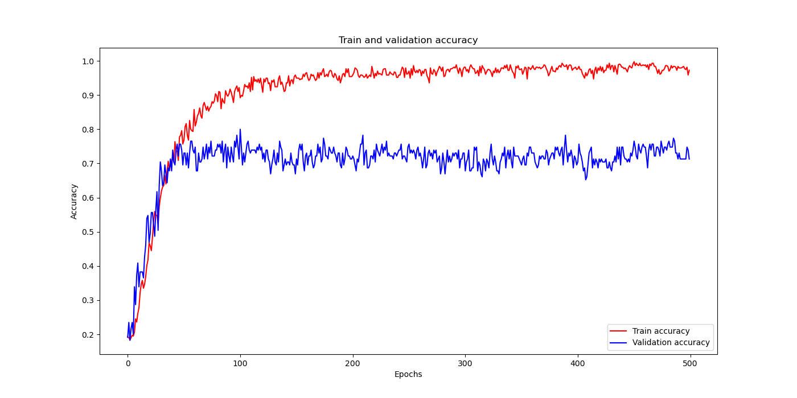

# ChessPieceRecognition
Prediction model for recognizing which of the 6 different chess pieces is the piece from a given image

Using CNN I have created a model for recognizing chess pieces and trained it with batchSize = 32 and batchSize = 64
Batch size of 32 proved better and here are the graphs for accuracy and loss

